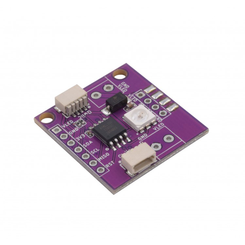

# Zio-Qwiic-RGB-LED-APA102

> This product can be available for purchase [here](https://www.smart-prototyping.com/Zio-Qwiic-RGB-LED-APA102).

#### Description

This is a ZIO Qwiic board featuring the incredibly bright and colorful APA102 (5mm x 5mm), SMD addressable RGB LED. The board can be also used as a driver board to control multiple APA102 LEDs , simply connect more APA102 as you want (max. to 100 LEDs), chain them together to the Zio Qwiic RGB LED board. 

We created the board that makes 5050 SMD LED much more accessible and works on I2C interface. Isn’t it awesome? 

The APA102-5050 LED with an integrated control circuit embedded can set the RGB color on a constant current output value and 5-bit (32 level) brightness setting. Pretty challenging to incorporate an IC on an LED right? If you take a glance inside, you can even see the minuscul gold microcontroller and the golden connections to the LED. 

The command to operate the LED is sent to the ATtiny85-20SU that controls the RGB LED.

We also provided the pinout to be able to deal with the LED data and the ATtiny85-20SU!

> Note: You must use a 5V DC Power supply to power the APA102 LED Strips. Watch the the current consumption when using an LED strips, 5V 4A power supply for 0.5m/ 1m and 5V 10A up to 2m (depending on the application)

#### Specification

* Operation Voltage: 3.3V
* Operating Temperature: -40°C - 40°C
* IC: ATTINY85-20SU
* I2C address: 0x22, 0x23 (Default:0x23)
* Dimensions: 25.8 x 28.3mm
* Weight: 2.9g

#### Links

* [LED APA102 Datasheet](http://www.smart-prototyping.com/image/data/2_components/Light/101791%20APA102C%20LED%20Strip/APA102C.pdf)
* [PCB source file and Gerber file](https://github.com/ZIOCC/Zio-Qwiic-RGB-LED-APA102)
* [ATtiny85-20SU Firmware](https://github.com/ZIOCC/Zio-Qwiic-RGB-LED-APA102/tree/master/Firmware/Qwiic_LED_Stick)
* [Testing Code (Sparkfun Qwiic LED Stick Arduino Library master)](https://github.com/sparkfun/SparkFun_Qwiic_LED_Stick_Arduino_Library)

> ###### About Zio
> Zio is a new line of open sourced, compact, and grid layout boards, fully integrated for Arduino and Qwiic ecosystem. Designed ideally for wearables, robotics, small-space limitations or other on the go projects. Check out other awesome Zio products [here](https://www.smart-prototyping.com/Zio).

